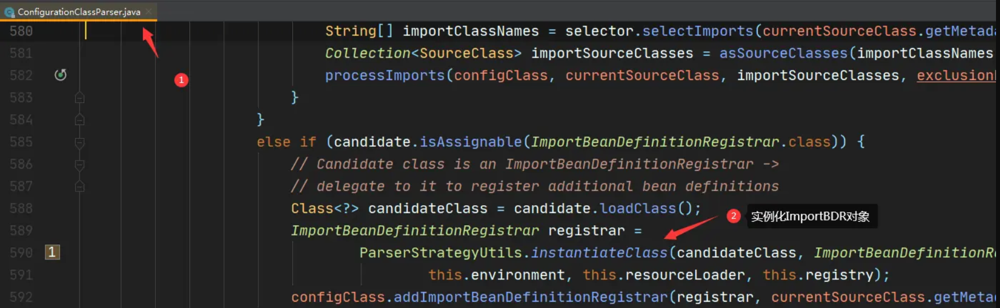
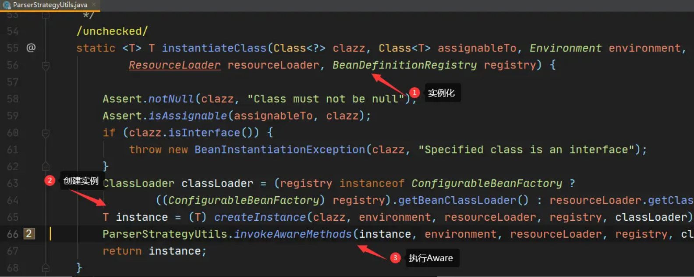
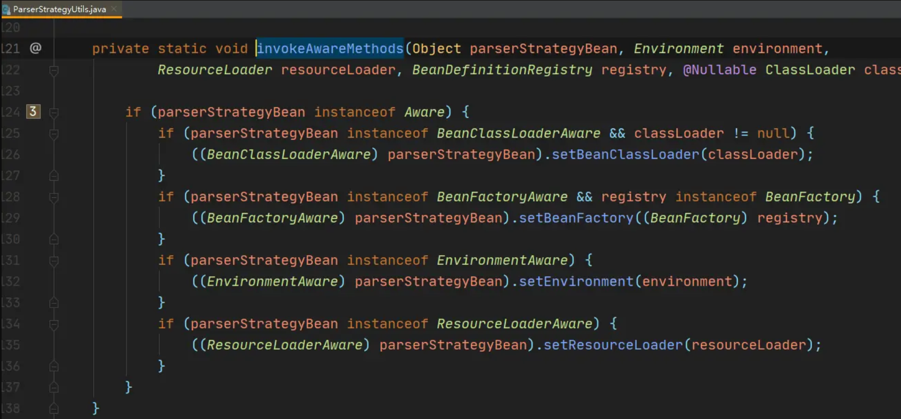

# 一、BeanDefinitionRegistryPostProcessor、BeanFactoryPostProcessor、BeanPostProcessor三者区别
## BeanDefinitionRegistryPostProcessor
唯一方法：BeanDefinitionRegistryPostProcessor#postProcessBeanDefinitionRegistry
作用：所有常规bd已经加载完毕，然后可以再添加一些额外的bd。
执行顺序：三个中最先执行的

比如下面几个都是Spring自己定义的，都是对BeanDefinitionRegistryPostProcessor接口的实现
```java
ConfigurationClassPostProcessor -----处理@Configuration注解
```
注意：BeanDefinitionRegistryPostProcessor接口继承了BeanFactoryPostProcessor接口。
## BeanFactoryPostProcessor
唯一方法：BeanFactoryPostProcessor#postProcessBeanFactory
作用：Bean实例化之前执行，所有的bd已经全部加载完毕，然后可以对这些bd做一些属性的修改或者添加工作。
执行时间：BeanFactoryPostProcessor是在spring容器加载了bean的定义文件之后，在Bean实例化之前执行

**官网的建议是BeanDefinitionRegistryPostProcessor用来添加额外的bd，而BeanFactoryPostProcessor用来修改bd。Spring允许BeanFactoryPostProcessor在容器实例化任何其它Bean之前读取配置元数据，并可以根据需要进行修改**

spring中，有内置的一些BeanFactoryPostProcessor实现类，常用的有：
```java
org.springframework.beans.factory.config.PropertyPlaceholderConfigurer
org.springframework.beans.factory.config.PropertyOverrideConfigurer
org.springframework.beans.factory.config.CustomEditorConfigurer：用来注册自定义的属性编辑器BeanPostProcessor
```
## BeanPostProcessor
作用：针对Bean实例化之后做一些逻辑处理
执行顺序：spring容器加载了Bean的定义并且实例化bean之后执行的。BeanPostProcessor的执行顺序是在BeanFactoryPostProcessor之后

spring中，有内置的一些BeanPostProcessor实现类，例如：
```java
org.springframework.context.annotation.CommonAnnotationBeanPostProcessor：支持@Resource注解的注入
org.springframework.beans.factory.annotation.RequiredAnnotationBeanPostProcessor：支持@Required注解的注入
org.springframework.beans.factory.annotation.AutowiredAnnotationBeanPostProcessor：支持@Autowired注解的注入
org.springframework.orm.jpa.support.PersistenceAnnotationBeanPostProcessor：支持@PersistenceUnit和@PersistenceContext注解的注入
org.springframework.context.support.ApplicationContextAwareProcessor：用来为bean注入ApplicationContext等容器对象
```
三者的执行顺序：
**BeanDefinitionRegistryPostProcessor > BeanFactoryPostProcessor > BeanPostProcessor**

在spring的启动过程中，在方法PostProcessorRegistrationDelegate#invokeBeanFactoryPostProcessors执行的时候，从这里可以看出来Spring执行这两个扩展类的先后顺序是这样的：

1. 先执行BeanDefinitionRegistryPostProcessor#postProcessBeanDefinitionRegistry方法
2. 在执行BeanDefinitionRegistryPostProcessor#postProcessBeanFactory方法，因为BeanDefinitionRegistryPostProcessor继承了BeanFactoryPostProcessor
3. 在执行BeanFactoryPostProcessor#postProcessBeanFactory方法
4. 最后BeanPostProcessor的回调方法

# 二、ImportBeanDefinitionRegistrar与BeanDefinitionRegistryPostProcessor的区别
## 概述
如果想实现自定义注册bean到spring容器中，常见的做法有两种

- @Import+ImportBeanDefinitionRegistrar
- BeanDefinitionRegistryPostProcessor

BeanDefinitionRegistryPostProcessor与ImportBeanDefinitionRegistrar都是接口，通过实现任意一个就可以获取到bean定义注册器：BeanDefinitionRegistry，通过调用其方法
```java
void registerBeanDefinition(String beanName, BeanDefinition beanDefinition);
```
就可以给spring容器中新增自定义的bean
那么二者到底有啥区别，spring为啥会提供两种方式，我们如何根据需求进行选择呐？
## 使用
首先使用上，二者的使用方式区别很大
### ImportBeanDefinitionRegistrar
ImportBeanDefinitionRegistrar的用法是@Import+ImportBeanDefinitionRegistrar，比如现在要把一个spring扫描路径之外的类加入bean容器，该类如下
```java
package com.ext; // 不在application主类扫描包下
import lombok.Data;

@Data
public class Ext {
    private String name; // 只有一个name属性
}
```
此时可以写一个注解，并添加defaultName属性
```java
@Retention(RetentionPolicy.RUNTIME)
@Target(ElementType.TYPE)
@Documented
@Import(ExtScannerRegistrar.class)
public @interface ExtScan {
    String defaultName(); //默认名称
}
```
使用@Import注解引入ExtScannerRegistrar，它就是一个ImportBeanDefinitionRegistrar实现，代码如下
```java
public class ExtScannerRegistrar implements ImportBeanDefinitionRegistrar {
    @Override
    public void registerBeanDefinitions(AnnotationMetadata importingClassMetadata, BeanDefinitionRegistry registry) {
        // 获取到ExtScan注解的defaultName属性
        AnnotationAttributes scanAttrs = AnnotationAttributes.fromMap(importingClassMetadata.getAnnotationAttributes(ExtScan.class.getName()));
        String defaultName = scanAttrs.getString("defaultName");
        // 构造Ext的bean定义
        BeanDefinitionBuilder builder = BeanDefinitionBuilder.genericBeanDefinition(Ext.class);
        // 给name属性赋值defaultName
        builder.addPropertyValue("name", defaultName);
        // 加入到bean容器
        registry.registerBeanDefinition("ext", builder.getBeanDefinition());
    }
}
```
此时Ext包虽然不在spring的扫描路径下，但通过getBean依然可以获得，并且得到的bean的name属性值就是自定注解@ExtScan的指定值，如下
```java
@SpringBootApplication
@ExtScan(defaultName = "pq先生")
public class Application {

    public static void main(String[] args) {
        ConfigurableApplicationContext context = SpringApplication.run(Application.class, args);
        Ext ext = context.getBean(Ext.class);
        System.out.println(ext.getName()); // 输出：pq先生
    }
    
}
```
### BeanDefinitionRegistryPostProcessor
bean定义后置处理器，同样是上面的例子，我们使用BeanDefinitionRegistryPostProcessor把Ext类加入spring容器，写法如下
```java
@Component // 本身首先是个bean
public class ExtRegistryPostProcessor implements BeanDefinitionRegistryPostProcessor {
    @Override
    public void postProcessBeanDefinitionRegistry(BeanDefinitionRegistry registry) throws BeansException {
        // 构造Ext的bean定义
        BeanDefinitionBuilder builder = BeanDefinitionBuilder.genericBeanDefinition(Ext.class);
        // 加入到bean容器
        registry.registerBeanDefinition("ext", builder.getBeanDefinition());
    }

    @Override
    public void postProcessBeanFactory(ConfigurableListableBeanFactory beanFactory) throws BeansException {
        // 不用
    }
}
```
同样get，去掉上一步的@ExtScan注解
```java
@SpringBootApplication
public class Application {

    public static void main(String[] args) {
        ConfigurableApplicationContext context = SpringApplication.run(Application.class, args);
        Ext ext = context.getBean(Ext.class); 
        System.out.println(ext.getName()); // 输出null
    }
    
}
```
同样可以把Ext加入bean容器，因为没有设置name，所以name是null
## 原理
二者的执行逻辑和时机可以参照[一文通透spring的初始化](https://www.jianshu.com/p/5729a95d8436)，这里就简单总结一下，不做赘述

- @Import是**spring启动执行BeanFactory后置处理器**时被spring内置后置处理器ConfigurationClassPostProcessor解析，如果发现@Import引入的是一个ImportBeanDefinitionRegistrar的实现，则会立即调用其registerBeanDefinitions方法
- 在**spring启动执行BeanFactory后置处理器**时，BeanDefinitionRegistryPostProcessor的实现作为bean首先被ConfigurationClassPostProcessor扫描并加入spring容器中，后续会再去spring容器中查找所有的后置处理器并执行

其实二者的执行时机都是：**spring启动执行BeanFactory后置处理器**，其中ConfigurationClassPostProcessor作为spring内置的后置处理器执行优先级较高，他的内部会调用ImportBeanDefinitionRegistrar的实现，而BeanDefinitionRegistryPostProcessor与ConfigurationClassPostProcessor一样都是后置处理器，属于同级别的(其实是由ConfigurationClassPostProcessor衍生出来)，会在ConfigurationClassPostProcessor执行完毕后依次被执行
从这里看，二者的定位不太一样ImportBeanDefinitionRegistrar输入后置处理器ConfigurationClassPostProcessor的一个自逻辑，BeanDefinitionRegistryPostProcessor本身就是一个后置处理器
当然这是本质上的区别，具体还要看使用区别
## 区别
### ImportBeanDefinitionRegistrar的优势
从上面那个例子上其实可以看出，ImportBeanDefinitionRegistrar的registerBeanDefinitions方法相较于BeanDefinitionRegistryPostProcessor多了个AnnotationMetadata参数，利用这个参数可以获取到含有@Import注解的类的一些属性，比如上面的defaultName，这样用户就可以通过注解的属性定制化一些功能，例如我们常用mybaits，可以通过
```java
@MapperScan("com.pq.xxx")
```
指定扫描的包名，方便实现用的自定义配置，这一点是BeanDefinitionRegistryPostProcessor做不到的
且@Import自带的把第三方pojo引入spring的特性，加上注解编程的优雅，让@Import+ImportBeanDefinitionRegistrar组合在很多第三方工具框架很常见
### BeanDefinitionRegistryPostProcessor的优势
BeanDefinitionRegistryPostProcessor的实现首先是一个bean，如上例使用@Component注解才会生效，作为bean本身，自定义后置处理器可以依赖注入其它bean，也可以实现各种Aware以得到上下文环境，所有常规bean的生命周期和功能它都有，这一点是作为POJO的ImportBeanDefinitionRegistrar实现不具备的
实际上ImportBeanDefinitionRegistrar也可以实现几个固定的Aware，但ImportBeanDefinitionRegistrar的实例化代码是ConfigurationClassParser单独实现的，并不是createBean那一套，如下


使用ParserStrategyUtils.instantiateClass方法来实例化ImportBeanDefinitionRegistrar


在创建实例后，使用ParserStrategyUtils.invokeAwareMethods执行Aware，进去看一下


就执行这固定四个Aware:BeanClassLoaderAware,BeanFactoryAware,EnvironmentAware,ResourceLoaderAware
这相比于spring bean声明周期中的Aware少太多
## 总结
今天大概梳理一下ImportBeanDefinitionRegistrar与BeanDefinitionRegistryPostProcessor的区别，二者各有自己的优势，了解了区别，至于使用哪个，就看使用场景就可以了
当然也可以二者一起使用，即ImportBeanDefinitionRegistrar注册的bean是一个BeanDefinitionRegistryPostProcessor的实现，这样就形成了@Import+ImportBeanDefinitionRegistrar+BeanDefinitionRegistryPostProcessor
比如mybaits就是使用这种方式，整合了二者的优势(_既可以使用@MapperScan+@Import+ImportBeanDefinitionRegistrar来定制扫描包，又可以通过BeanDefinitionRegistryPostProcessor在注册bean前通过ApplicationContextAware获得applicationContext对象_)
